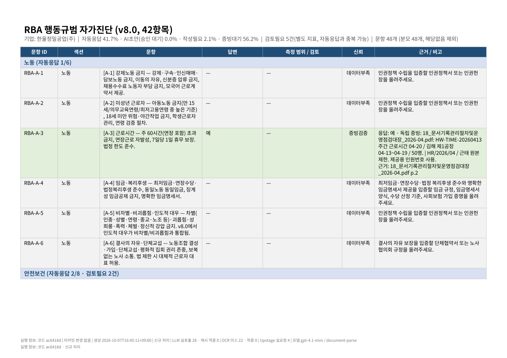
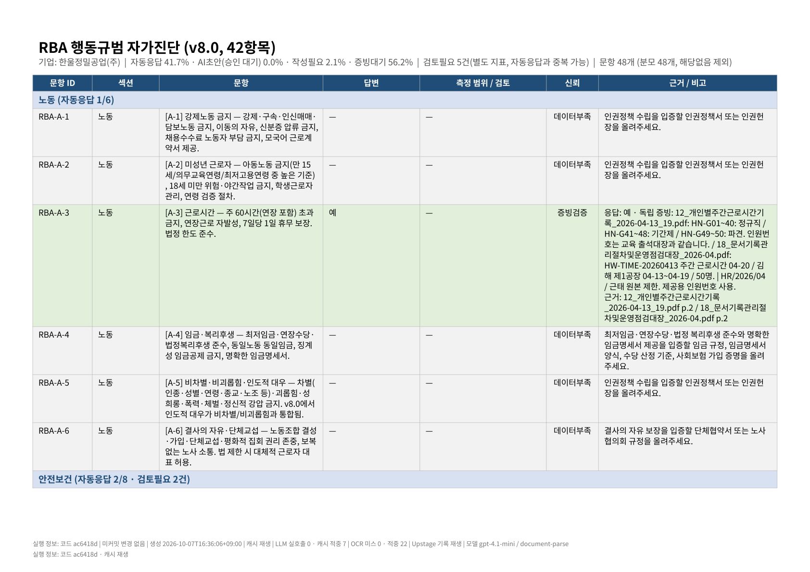

# 실행 출처 표시 캡처 — 신규 처리 / 캐시 재생

작업지시서 B §3 통과 조건 2. 두 실행 모두 새 증빙 세트(정상 5건 보강),
`--code-path ../ESGenie-B2`, `--stage initial`.

## 신규 처리 (`fresh`)

- 실행 폴더: `initial` / PDF 23쪽
- `processing.label`: **신규 처리**
- 첫 쪽 요약 줄: `실행 정보: 코드 ac6418d | 미커밋 변경 없음 | 생성 2026-10-07T16:45:11+09:00 | 신규 처리 | LLM 실호출 28 · 캐시 적중 0 | OCR 미스 22 · 적중 0 | Upstage 실요청 4 | 모델 gpt-4.1-mini / document-parse`
- 바닥글: `실행 정보: 코드 ac6418d · 신규 처리`
- 바닥글이 모든 쪽에 정확히 1번: **True** (쪽별 [1, 1, 1, 1, 1, 1, 1, 1, 1, 1, 1, 1, 1, 1, 1, 1, 1, 1, 1, 1, 1, 1, 1])
- 요약 줄이 1쪽에만: **True** (쪽별 [1, 0, 0, 0, 0, 0, 0, 0, 0, 0, 0, 0, 0, 0, 0, 0, 0, 0, 0, 0, 0, 0, 0])

바닥글(1쪽) 

바닥글(마지막 쪽) 

### Excel `실행정보` 시트

| 항목 | 값 |
|---|---|
| 코드 커밋 | ac6418d661d7bb4cda4a6787398aa6b0277198f6 |
| 미커밋 변경 | 없음 |
| 생성 시각(KST) | 2026-10-07T16:45:11+09:00 |
| 처리 방식 | 신규 처리 |
| LLM 실호출 | 28 |
| LLM 캐시 적중 | 0 |
| LLM 캐시 미스 | 28 |
| LLM 캐시 모드 | on |
| LLM 수치 기준 | 실행 구간 |
| OCR 캐시 적중 | 0 |
| OCR 캐시 미스 | 22 |
| OCR 캐시 모드 | miss |
| Upstage 기록 재생 | 아니오 |
| Upstage 실요청 | 4 |
| LLM 모델 | gpt-4.1-mini (azure_openai) |
| OCR 모델 | document-parse (upstage_document_parse) |
| OCR 보정 LLM | gpt-4.1-mini |
| OpenAI 키 | 설정됨 |
| Anthropic 키 | 없음 |
| Upstage 키 | 설정됨 |

## 캐시 재생 (`replay`)

- 실행 폴더: `initial` / PDF 23쪽
- `processing.label`: **캐시 재생**
- 첫 쪽 요약 줄: `실행 정보: 코드 ac6418d | 미커밋 변경 없음 | 생성 2026-10-07T16:36:06+09:00 | 캐시 재생 | LLM 실호출 0 · 캐시 적중 7 | OCR 미스 0 · 적중 22 | Upstage 기록 재생 | 모델 gpt-4.1-mini / document-parse`
- 바닥글: `실행 정보: 코드 ac6418d · 캐시 재생`
- 바닥글이 모든 쪽에 정확히 1번: **True** (쪽별 [1, 1, 1, 1, 1, 1, 1, 1, 1, 1, 1, 1, 1, 1, 1, 1, 1, 1, 1, 1, 1, 1, 1])
- 요약 줄이 1쪽에만: **True** (쪽별 [1, 0, 0, 0, 0, 0, 0, 0, 0, 0, 0, 0, 0, 0, 0, 0, 0, 0, 0, 0, 0, 0, 0])

바닥글(1쪽) 

바닥글(마지막 쪽) 

### Excel `실행정보` 시트

| 항목 | 값 |
|---|---|
| 코드 커밋 | ac6418d661d7bb4cda4a6787398aa6b0277198f6 |
| 미커밋 변경 | 없음 |
| 생성 시각(KST) | 2026-10-07T16:36:06+09:00 |
| 처리 방식 | 캐시 재생 |
| LLM 실호출 | 0 |
| LLM 캐시 적중 | 7 |
| LLM 캐시 미스 | 0 |
| LLM 캐시 모드 | on |
| LLM 수치 기준 | 실행 구간 |
| OCR 캐시 적중 | 22 |
| OCR 캐시 미스 | 0 |
| OCR 캐시 모드 | hit |
| Upstage 기록 재생 | 예 |
| Upstage 실요청 | 0 |
| LLM 모델 | gpt-4.1-mini (azure_openai) |
| OCR 모델 | document-parse (upstage_document_parse) |
| OCR 보정 LLM | gpt-4.1-mini |
| OpenAI 키 | 설정됨 |
| Anthropic 키 | 없음 |
| Upstage 키 | 설정됨 |
